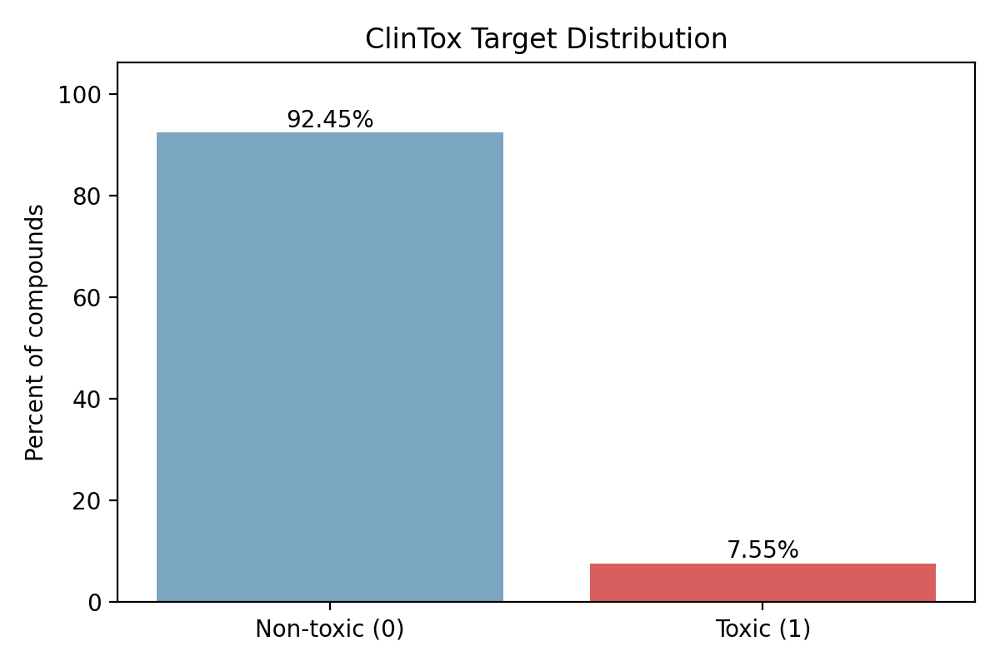
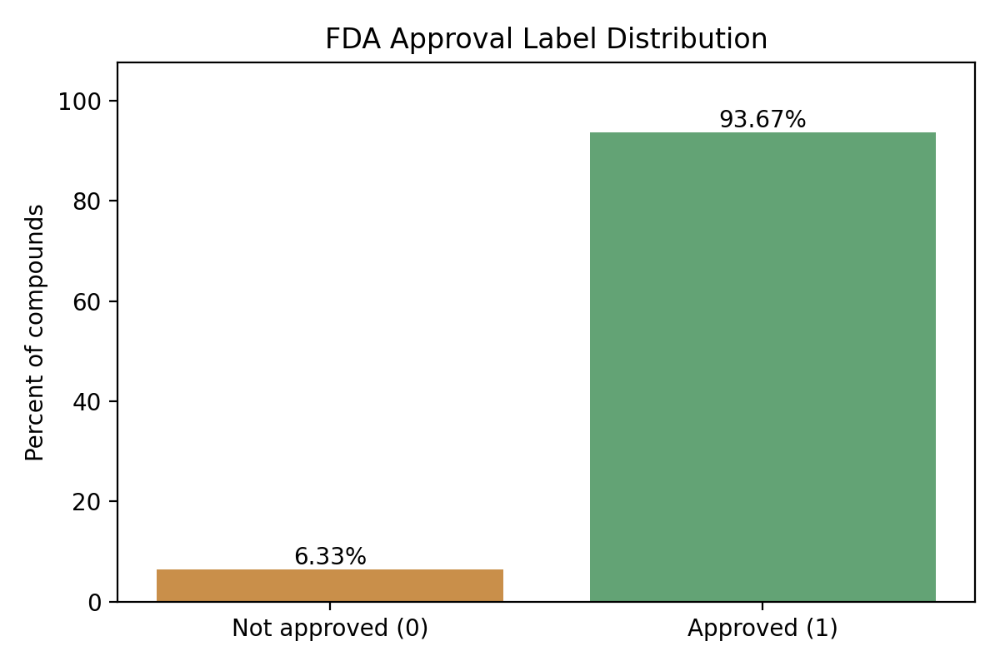
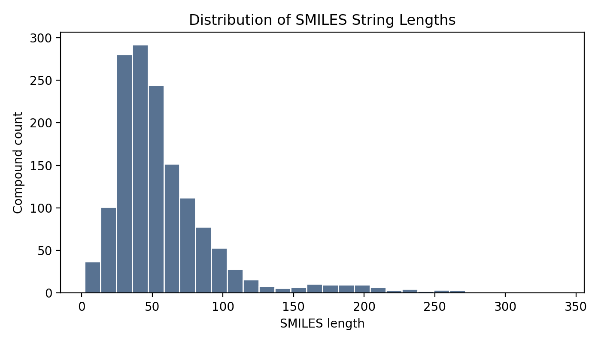
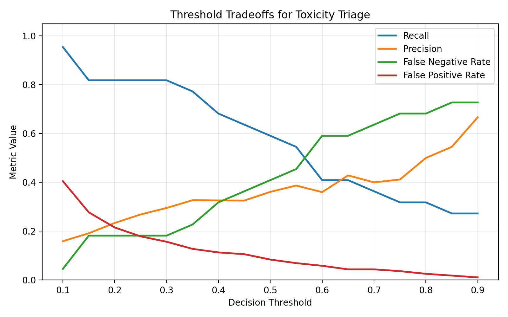
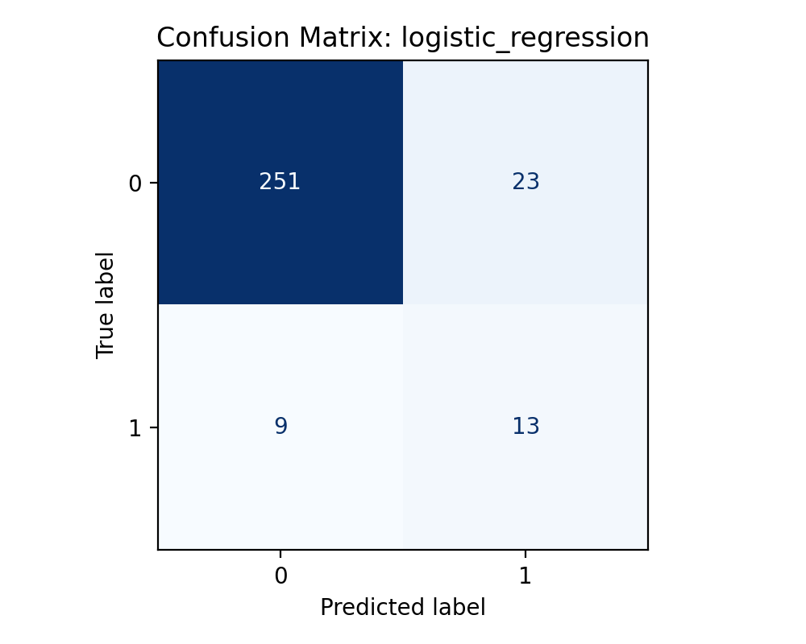

# ToxScreen Risk Prioritization

ToxScreen Risk Prioritization is a supervised machine learning project for early-stage compound safety screening. The system uses molecular structure data from the ClinTox benchmark to predict whether a small-molecule drug candidate is likely to be toxic or non-toxic, with special attention to false negatives in safety-sensitive screening.

## Core story

This project is built around one simple story:

**We use molecular structure data to predict clinical toxicity risk early, with special attention to false negatives.**

That story drives the technical choices in the pipeline:

- molecules are represented from SMILES strings and transformed into Morgan fingerprints
- the target is clinical trial toxicity risk via `CT_TOX`
- evaluation emphasizes recall, PR-AUC, confusion matrices, and threshold tradeoffs
- threshold selection is designed to reduce dangerous misses, where a toxic compound is predicted as safe

The repository is organized like a lightweight data science product handoff:

- reproducible environment
- clean command-line workflow
- config-driven training pipeline
- business-facing metrics and plots
- threshold analysis for safety-first decision making
- documentation a non-technical reviewer can follow

## Why this project matters

Drug development is expensive, slow, and risky. A toxicity screening model will never replace lab validation or clinical judgment, but it can help research teams prioritize compounds earlier and reduce the chance of pushing high-risk candidates deeper into the pipeline.

This project focuses on one business question:

**Can we build a binary classifier that helps flag potentially toxic compounds early enough to support safer portfolio triage?**

## What the project does

The pipeline:

1. Loads ClinTox data from a local CSV
2. Validates required fields and profiles class balance
3. Converts SMILES strings into Morgan fingerprints with RDKit
4. Trains two baseline production-friendly models:
   - Logistic Regression
   - Random Forest
5. Evaluates model quality with metrics suited for imbalanced safety problems
6. Sweeps decision thresholds to quantify the false-negative vs false-positive tradeoff
7. Recommends a safety-oriented operating threshold

## Project highlights

- Binary target: `CT_TOX`
- Modeling objective: predict clinical toxicity risk from molecular structure
- Molecular representation: Morgan fingerprints
- Fingerprint settings: radius `2`, bits `2048`
- Baseline model: Logistic Regression
- Comparison model: Random Forest
- Key metrics: Precision, Recall, F1, ROC-AUC, PR-AUC, Confusion Matrix
- Risk lens: false negatives are treated as the most dangerous error type
- Product-style artifact output: JSON metrics, CSV threshold tables, PNG visualizations, and a written results summary

## Repository layout

```text
toxscreen-risk-prioritization/
├── src/toxscreen/        # training, evaluation, features, CLI
├── data/raw/            # ClinTox CSV
├── outputs/             # metrics and generated artifacts
├── docs/figures/        # tracked visualizations for GitHub
├── reports/             # project brief and writeup support
└── main.py              # command-line entrypoint
```

## Quickstart

### 1. Clone the repository

```bash
git clone https://github.com/szvidzwa-pixel/toxscreen-risk-prioritization
cd toxscreen-risk-prioritization
```

### 2. Create and activate a virtual environment

On macOS or Linux:

```bash
python3 -m venv .venv
source .venv/bin/activate
```

On Windows PowerShell:

```powershell
python -m venv .venv
.venv\Scripts\Activate.ps1
```

### 3. Install dependencies

```bash
pip install --upgrade pip
pip install -r requirements.txt
```

Confirm that RDKit installed correctly before running the project:

```bash
python -c "from rdkit import Chem; print('RDKit installed correctly')"
```

Important: run the project from the virtual environment.

If the wrong Python interpreter is used, the project may fail with an error like `ModuleNotFoundError: No module named 'rdkit'`. That means the script is being run outside `.venv`.

If needed, run the project explicitly with:

```bash
.venv/bin/python run_end_to_end.py
```

In VS Code, select the interpreter inside:

```text
.venv/bin/python
```

### 4. Add the dataset

Place the ClinTox CSV here:

```text
data/raw/clintox.csv
```

Expected columns:

- `smiles`
- `CT_TOX`

The loader normalizes capitalization automatically.

### 5. Run the project end to end

For the simplest experience, run:

```bash
python run_end_to_end.py
```

This uses the built-in project paths:

- `data/raw/clintox.csv`
- `configs/defaults.json`

It runs the dataset audit, trains both models, writes the output files, and prints a guided end-to-end walkthrough in the terminal that explains what each step is doing and how to interpret the results.

You can also run:

```bash
python main.py
```

which executes the same default end-to-end workflow.

### 6. Audit the dataset separately

```bash
python main.py audit --data data/raw/clintox.csv
```

This generates the EDA summary, label distributions, data quality checks, and core visualizations used in the writeup.

### 7. Train the models separately

```bash
python main.py train --data data/raw/clintox.csv --config configs/defaults.json
```

### 8. Run tests

```bash
pytest
```

## Example outputs

After a successful run, the project writes:

- `outputs/metrics/dataset_profile.json`
- `outputs/metrics/eda_summary.md`
- `outputs/metrics/model_metrics.json`
- `outputs/metrics/model_comparison.csv`
- `outputs/metrics/threshold_analysis.csv`
- `outputs/metrics/results_summary.md`
- tracked visualizations in `docs/figures/`

The EDA summary is important before modeling because it documents the class imbalance explicitly. For example, the audit workflow reproduces checks such as:

```python
df["CT_TOX"].value_counts(normalize=True)
```

## Design choices

### Why Morgan fingerprints

SMILES strings are not directly usable by most classical ML models. Morgan fingerprints convert molecular structure into a fixed-length binary vector that captures local structural neighborhoods and is widely used in cheminformatics.

### Why Logistic Regression

It gives an interpretable, credible baseline and is fast to train on sparse binary features.

### Why Random Forest

It offers a stronger nonlinear comparison model while remaining easier to explain than a deep learning architecture.

### Why threshold analysis is central

In toxicity screening, a false negative means a toxic compound is predicted to be safe. That kind of mistake is more dangerous than a false positive. This repository treats threshold selection as part of the product, not an afterthought.

## Results

The dataset is highly imbalanced, with toxic compounds representing about `7.55%` of the full sample, which makes recall for the toxic class especially important. In the tuned run, Logistic Regression produced the strongest held-out performance, with `ROC-AUC = 0.882`, `PR-AUC = 0.474`, `precision = 0.361`, and `recall = 0.591`, outperforming the Random Forest baseline on toxic-compound detection.

Threshold tuning materially improved the safety profile of the system. Lowering the Logistic Regression decision threshold from `0.50` to the recommended `0.30` increased toxic-class recall from `0.591` to `0.818` and reduced false negatives from `9` to `4`. The tradeoff was an increase in false positives from `23` to `43`, which reflects the central precision-recall tradeoff in early toxicity screening.

See: `outputs/metrics/results_summary.md`

## EDA Visualizations

The project includes visual EDA artifacts for dataset understanding and data quality review.

### Dataset description and class distribution

- Total rows: `1484`
- Target endpoint: `CT_TOX`
- Non-toxic compounds: `1372` (`92.45%`)
- Toxic compounds: `112` (`7.55%`)
- Missing values: `0` in `smiles`, `FDA_APPROVED`, and `CT_TOX`
- Duplicate SMILES: `0`





### Data quality and molecular string structure

The EDA also checks whether the dataset has missing labels, duplicate molecular strings, and unusually short or long SMILES strings.



### Threshold tradeoff visualization

This plot shows how decision-threshold changes affect recall, precision, false negatives, and false positives for a safety-first screening workflow.



## Model Evaluation Visualizations

After EDA, the project compares model behavior with confusion matrices and threshold plots so the evaluation is visible instead of only reported in metric tables.

### Confusion matrices




These plots make the class-imbalance problem easier to interpret. The tuned Logistic Regression model identifies more toxic compounds than the Random Forest model on the held-out set, which is why it remains the stronger safety-first baseline in this project.

## How to read the results

Recommended reading order:

1. `dataset_profile.json` to understand class balance and data quality
2. `model_comparison.csv` to compare baseline model performance
3. `threshold_analysis.csv` and `threshold_tradeoffs.png` to inspect the false-negative tradeoff
4. `results_summary.md` for the final plain-English interpretation

## Notes

- This is a portfolio project, not a clinical decision system.
- The included report brief supports the project paper and presentation materials.

## Author
Shalom Zvidzwa
